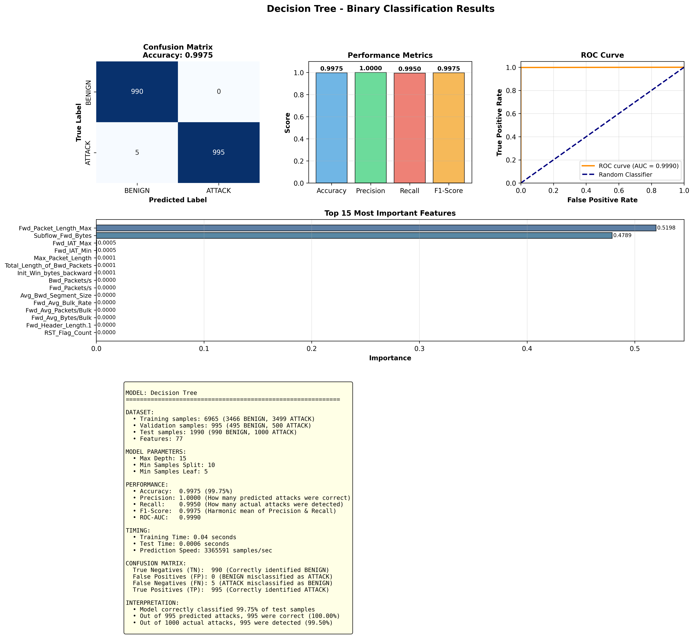
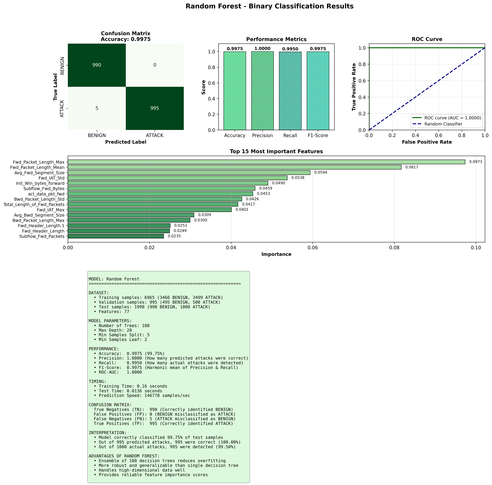
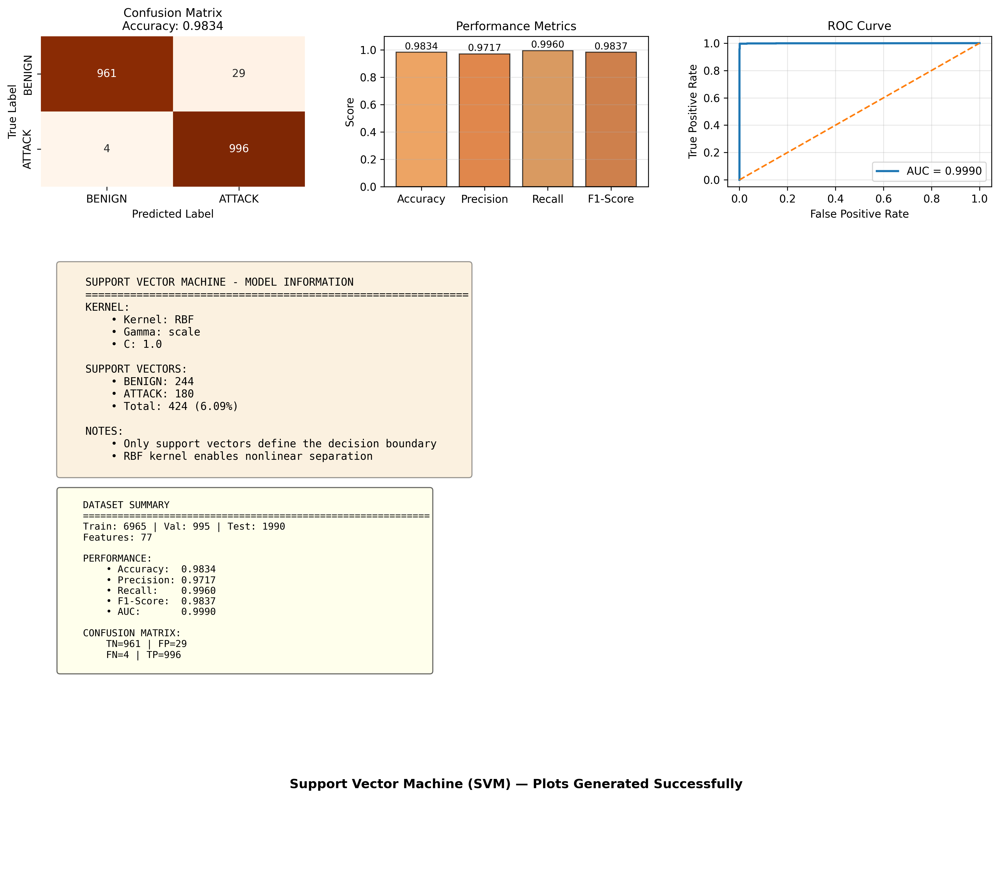
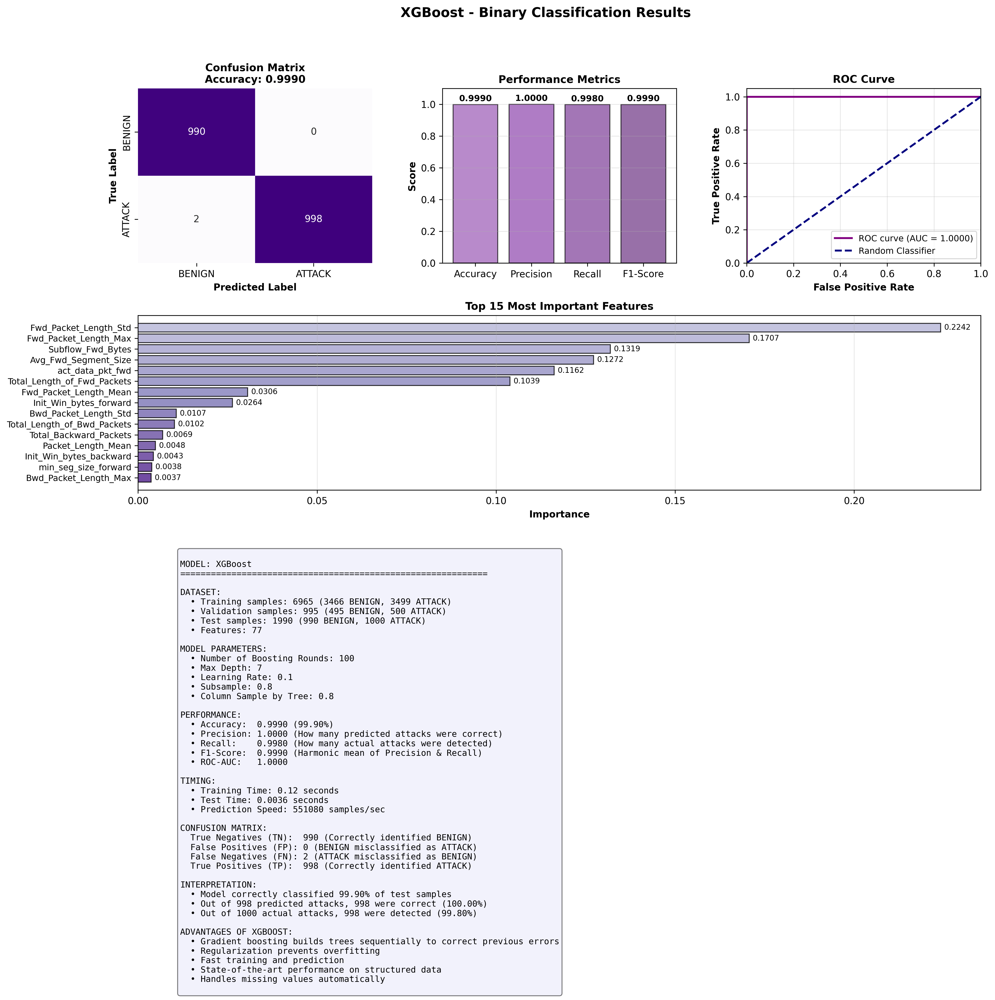

# 🧠 Network Intrusion Detection System

This project implements a machine learning-based network intrusion detection system using the CICIDS 2017 dataset. The system performs binary classification to distinguish between benign and malicious network traffic, with plans to extend to multi-class classification and anomaly detection.

---

## 📂 Dataset

**Source:** [CICIDS 2017 Dataset](https://www.unb.ca/cic/datasets/ids-2017.html)

For this implementation, we used a sample from `Friday-WorkingHours-Afternoon-DDos.pcap_ISCX.csv`:
- **Total samples:** 10,000 (5,000 BENIGN + 5,000 ATTACK)
- **Split ratio:** 70% Train / 10% Validation / 20% Test
- **Features:** 77 numerical features after preprocessing

### Dataset Setup

1. Download `GeneratedLabelledFlows.zip` from the official page
2. Extract and place the `TrafficLabelling/` folder in your project directory

**Project structure:**
```
PHISHING ATTACK/
├── data_preprocess.py           # Data preprocessing pipeline
├── data_visualizer.py            # Data visualization code
├── decision_tree_binary.py       # Decision Tree model
├── random_forest_binary.py       # Random Forest model
├── svm_binary.py                 # Support Vector Machine model
├── xgBoost_binary.py            # XGBoost model
├── requirements.txt
├── README.md
├── .gitignore
├── TrafficLabelling/            # Raw dataset
│   ├── Friday-WorkingHours-Afternoon-DDos.pcap_ISCX.csv
│   └── ...
├── preprocessed_data/           # Processed datasets
│   ├── feature_names.txt
│   ├── test_data.csv
│   ├── train_data.csv
│   └── val_data.csv
├── plots/                       # Model visualizations
│   ├── class_balance.png
│   ├── decision_tree_results.png
│   ├── random_forest_results.png
│   └── svm_results_clean.png
│   └── xgboost_results.png
│   └── preprocessing_summary.png
├── trained_models/              # Saved model files (.pkl)
│   ├── decision_tree_model.pkl
│   ├── random_forest_model.pkl
│   ├── svm_model.pkl
│   └── xgboost_model.pkl
└── venv/                        # Virtual environment
```

---

## ⚙️ Data Preprocessing Pipeline

Our preprocessing workflow applies several techniques to prepare the raw network traffic data for machine learning:

### 1. **Balanced Sampling**
- Extracted 5,000 samples per class (BENIGN/ATTACK)
- Ensures balanced representation for binary classification
- Prevents model bias toward majority class

### 2. **Data Cleaning**
- Removed non-numeric columns (Flow ID, IP addresses, timestamps)
- Handled infinite values and missing data
- Removed duplicate records
- Final feature set: **77 numerical features**

### 3. **Feature Normalization**
- Applied **Z-score standardization**: `(x - μ) / σ`
- Scales all features to have mean ≈ 0 and std ≈ 1
- Improves model convergence and performance

### 4. **Train-Validation-Test Split**
- Training: 70% (6,965 samples)
- Validation: 10% (995 samples)
- Test: 20% (1,990 samples)
- Stratified split maintains class balance across all sets

### Preprocessing Results

| Dataset | Samples | BENIGN | ATTACK |
|---------|---------|--------|--------|
| Train   | 6,965   | 3,466  | 3,499  |
| Validation | 995  | 495    | 500    |
| Test    | 1,990   | 990    | 1,000  |

---

## 📦 Project Files

| File | Description |
|------|-------------|
| `data_preprocess.py` | Preprocessing pipeline: sampling, cleaning, normalization, and splitting |
| `data_visualizer.py` | Data exploration and visualization code |
| `decision_tree_binary.py` | Decision Tree classifier implementation |
| `random_forest_binary.py` | Random Forest classifier implementation |
| `svm_binary.py` | Support Vector Machine classifier implementation |
| `xgBoost_binary.py` | XGBoost classifier implementation |
| `preprocessed_data/` | Train/validation/test CSV files and feature names |
| `plots/` | Performance visualization images for all models |
| `trained_models/` | Serialized model files (.pkl) for deployment |

We trained and evaluated four supervised learning algorithms for binary classification:

### Model Comparison

| Model | Accuracy | Precision | Recall | F1-Score | ROC-AUC |
|-------|----------|-----------|--------|----------|---------|
| **XGBoost** | **99.90%** | **1.0000** | **0.9980** | **0.9990** | **1.0000** |
| **Random Forest** | 99.75% | 1.0000 | 0.9950 | 0.9975 | 1.0000 |
| **Decision Tree** | 99.75% | 1.0000 | 0.9950 | 0.9975 | 0.9990 |
| **SVM (RBF)** | 98.34% | 0.9717 | 0.9960 | 0.9837 | 0.9990 |

---

## 📊 Model Results & Visualizations

### 1. Decision Tree


**Performance:**
- Accuracy: 99.75%
- Fast training (0.04s) and prediction speed (386,559 samples/sec)
- Top features: Forward packet length, Subflow forward bytes

### 2. Random Forest


**Performance:**
- Accuracy: 99.75%
- Perfect precision (1.0000) with minimal false positives
- Ensemble of 100 trees provides robust predictions
- More balanced feature importance distribution

### 3. Support Vector Machine (SVM)


**Performance:**
- Accuracy: 98.34%
- RBF kernel for non-linear separation
- Uses only 424 support vectors (6.09% of training data)
- Slightly more false positives (29) compared to tree-based models

### 4. XGBoost ⭐ **Best Performer**


**Performance:**
- **Highest accuracy: 99.90%**
- Perfect precision (1.0000) with only 2 false negatives
- Fast training (0.12s) and excellent prediction speed
- Gradient boosting effectively corrects previous errors
- Top features: Forward packet length statistics, Subflow bytes

---

## 🚀 Getting Started

### Prerequisites
- Python 3.12.3 or higher
- pip package manager

### Installation

1. **Clone the repository**
```bash
git clone <repository-url>
cd Network-IDS
```

2. **Create virtual environment**
```bash
python3 -m venv venv
source venv/bin/activate        # macOS/Linux
# OR
venv\Scripts\activate           # Windows
```

3. **Install dependencies**
```bash
pip install -r requirements.txt
```

### Usage

**Step 1: Preprocess the data**
```bash
python data_preprocess.py
```
This creates the `preprocessed_data/` folder with train/val/test splits and feature names.

**Step 2: Visualize the data (optional)**
```bash
python data_visualizer.py
```
Generates exploratory data analysis visualizations.

**Step 3: Train individual models**

Train each model separately:
```bash
# Decision Tree
python decision_tree_binary.py

# Random Forest
python random_forest_binary.py

# Support Vector Machine
python svm_binary.py

# XGBoost
python xgBoost_binary.py
```

Each script will:
- Load preprocessed data from `preprocessed_data/`
- Train the model on training data
- Evaluate on validation and test sets
- Save the trained model to `trained_models/` as a `.pkl` file
- Generate visualization plots in `plots/` folder

---

## 📦 Dependencies

```
pandas
numpy
scikit-learn
xgboost
matplotlib
seaborn
```

---

## 🎯 Future Work

We plan to extend this project in the following directions:

### 1. **Multi-Class Classification**
- Classify specific attack types (DDoS, DoS, Brute Force, etc.)
- Use the complete CICIDS 2017 dataset with all attack categories
- Compare model performance on granular threat detection

### 2. **Anomaly Detection**
- Implement unsupervised learning approaches (Isolation Forest, Autoencoders)
- Detect novel/zero-day attacks not seen during training
- Hybrid approach combining supervised and unsupervised methods

### 3. **Scalability**
- Train on larger datasets (full CICIDS 2017 with 2.8M samples)
- Implement online/incremental learning for real-time detection
- Optimize for production deployment

### 4. **Deep Learning**
- Experiment with neural networks (LSTM, CNN, Transformer-based models)
- Leverage temporal patterns in network traffic sequences

---

## 📈 Key Insights

1. **XGBoost achieves the best performance** with 99.90% accuracy and perfect ROC-AUC
2. **Tree-based models outperform SVM** on this dataset, likely due to their ability to capture complex feature interactions
3. **Forward packet length features are critical** for distinguishing attack patterns
4. **All models show excellent generalization** with minimal overfitting
5. **The preprocessing pipeline is effective** at creating a clean, balanced dataset

---

## 📝 Notes

- The dataset is not included in this repository due to its size
- Each model has its own training script for modular development
- Trained models are saved as `.pkl` files in `trained_models/` for reuse
- All visualizations are automatically saved to the `plots/` folder
- Preprocessing significantly improves model performance
- Results may vary slightly due to random sampling and model initialization
- For production use, load models from `trained_models/` using pickle

---